tasks-tracker-cli
=================

A CLI application to manage and track multiple tasks built with:

- **Typer**: A library for building Command Line Interface (CLI) applications based on Python's type hints.
- **Rich**: A library for rich text and beautiful formatting in the terminal.
- **Sqlite3**: A lightweight disk-based database that does not require a separate server process and allows accessing the database using a nonstandard variant of the SQL query language.

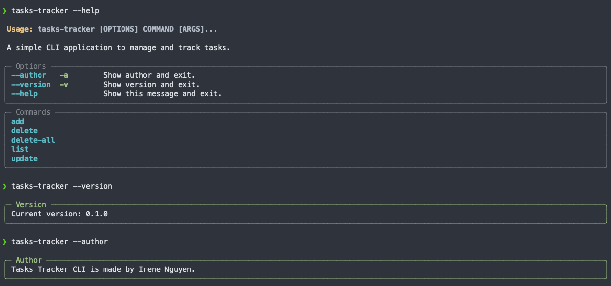

## Links

- [GitHub repository](https://github.com/irenenguyen1017/tasks-tracker-cli)
- [Presentation](https://vimeo.com/755099620)

## Features

- **Add command**: By using this command, users can add a new task with a title as required argument and other options for providing more detailed information.

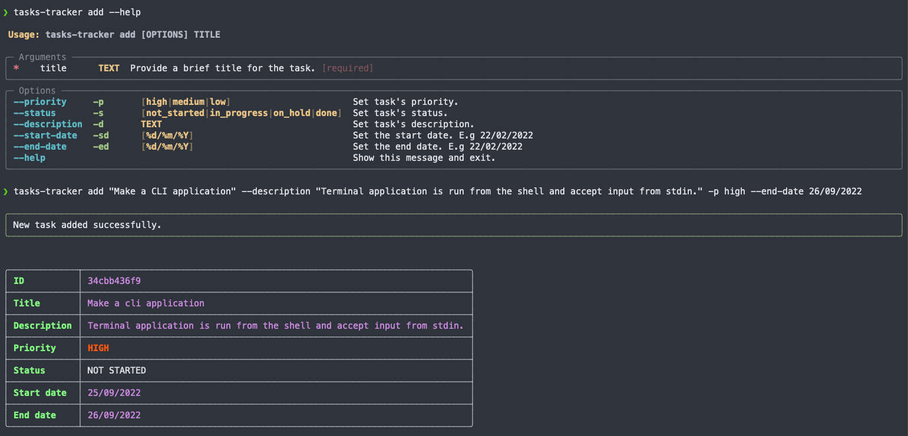

- **List command**: Users can see the list of tasks and filter by options.

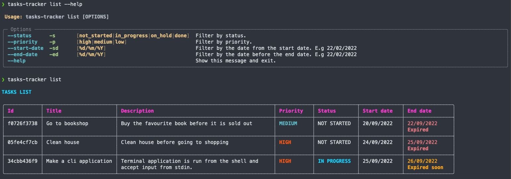

- **Update command**: With this command, users can update an existing task details.

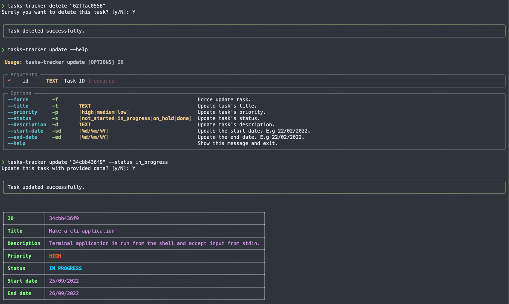

- **Delete command**: With this command, users can detete an existing task details.

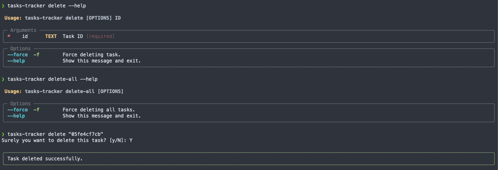

- **Delete all command**: With this command, users can delete all tasks.

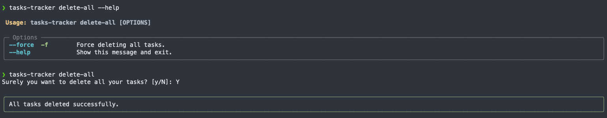

## Styling convention

This application uses the styling conventions in [PEP8](https://peps.python.org/pep-0008/), a document that provides guidelines and best practices for writing Python code.Packages used within this application for ensuring styling conventions:

- [**FLake8**](https://flake8.pycqa.org/en/latest/): A tool for style guide enforcement that wraps PyFlakes, pycodestyle and Ned Batchelder’s McCabe script.
- [**Black**](https://black.readthedocs.io/en/stable/): A uncompromising Python code formatter..
- [**Isort**](https://pycqa.github.io/isort/): A Python utility/library to sort imports alphabetically and automatically separated into sections and by type.

## Implementation Plan

> [Link to Trello Board](https://trello.com/invite/b/QtqaaVDA/cfb6c6d5734faa38f05a6bbf9f428278/tasks-tracker-cli)

### Add command implementation

> Subtasks:

- `title` argument for add command. (10m)
- `--help` option for instruction (15m)
- `--status` option to set task status. (10m)
- `--priority` option to set task priority. (10m)
- `--description` option to set task description.(10m)
- `--date-start` option to set start date.(10m)
- `--date-end` option to set end date.(10m)
- Write unit test.(40m)
- Database handler methods implementation (1hr)

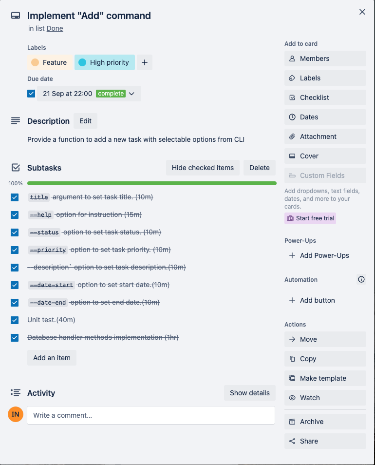

### List command implementation

> Subtasks:

- `--help` option for instruction (10m)
- `--status` option to filter tasks by status. (10m)
- `--priority` option to filter tasks by priority. (10m)
- `--date-start` option to filter tasks by start date. (10m)
- `--date-end` option to filter tasks by end date. (10m)
- Unit test (30m)
- Database handlers implementation. (1h30m)

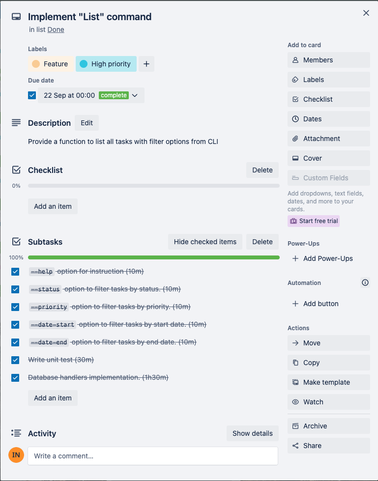

### Update command implementation

> Subtasks:

- `id` as required argument(5m)
- `--help` option for instruction (5m)
- `--title` option to update task title (10m)
- `--status` option to update task status. (10m)
- `--priority` option to update task priority. (10m)
- `--description` option to update task description. (10m)
- `--date-start` option to allow update start date. (10m)
- `--date-end` option to allow update end date. (10m)
- `--force` option to allow execute the command without prompt (10m)
- A prompt to confirm before deleting the task. (10m)
- Database handlers implementation (1h30m)
- Unit test.

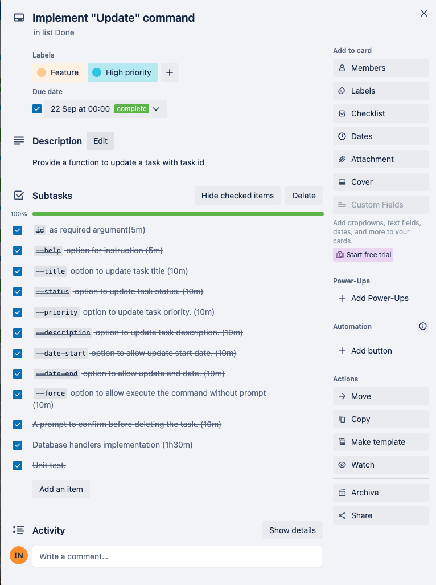

### Delete command implementation

> Subtasks:

- `id` as required argument(5m)
- `--help` option for instruction (5m)
- `--force` option to allow execute the command without prompt (10m)
- A prompt to confirm before deleting the task. (10m)
- Database handlers implementation (30m)
- Unit test.(30m)

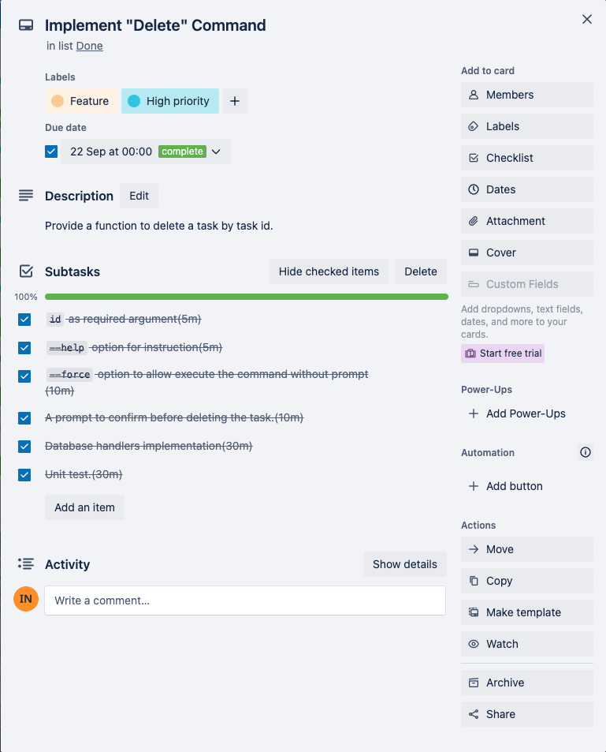

### Delete all command implementation

> Subtasks:

- `--help` option for instruction (5m)
- `--force` option to allow execute the command without prompt (10m)
- A prompt to confirm before deleting the task. (10m)
- Database handlers implementation (30m)
- Unit test.(30m)

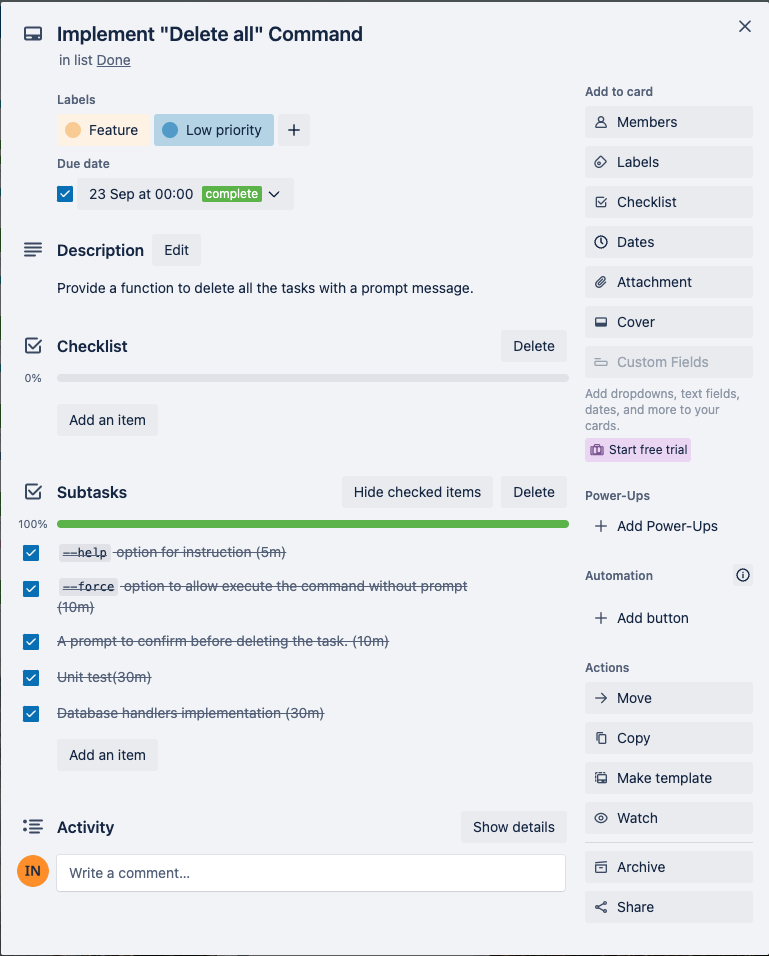

## Documentation

Please find the detailed documentation [here](./docs/instruction.md)

## Testing

Majority features were tested with 22 test cases to ensure it functions as expected.

> Version check

- Case 1: It should show app version when using `--version` option
- Case 2: The process should end with exit code 0

> Author check

- Case 1: It should show app author when using `--author` option
- Case 2: The process should end with exit code 0

> Add command

- Case 1: Make sure the instruction of `add` command is shown when using `--help` option.
- Case 2: Show the error message when adding a new task to database failed
- Case 3: Show the success message when adding a task to database succeeded.
- Case 4: The process should end with exit code 0

> List command

- Case 1: Make sure the instruction of `list` command is shown when using `--help` option.
- Case 2: It should show the empty list message when there is no task available.
- Case 3: It should display a table of tasks when tasks are available.
- Case 4: The process should end with exit code 0

> Update command

- Case 1: Make sure the instruction of `update` command is shown when using `--help` option.
- Case 2: It should show the prompt when not using `--force` option.
- Case 3: It shold show no task found error with the provided ID
- Case 4: It should skip the prompt when using `--force` option and show success message when updating task is successful.
- Case 5: It should show error message when updating task is failed.

> Delete command

- Case 1: Make sure the instruction of `delete` command is shown when using `--help` option.
- Case 2: It should show the prompt when not using `--force` option
- Case 3: It shold show no task found error with the provided ID
- Case 4: It should skip the prompt when using `--force` option and show success message when deleting task is successful.
- Case 5: It should show error message when deleting task is failed.

> Deleta all command

- Case 1: Make sure the instruction of `delete-all` command is shown when using `--help` option.
- Case 2: It should show the prompt when not using `--force` option
- Case 3 It should skip the prompt when using `--force` option and show success message when deleting all tasks is successful.
- Case 4: It should show error message when deleting all tasks is failed.

### Installation

`Tasks-tracker` requires `python3.10` and `pip` to be installed to run.

Clone the repository

```bash
git clone git@github.com:irenenguyen1017/tasks-tracker-cli.git
```

Install `tasks-tracker` package

- For Mac or Linux users, run:

```bash
cd tasks-tracker-cli && ./scripts/mac-linux-installer.sh
```

> If you face a permission error in Mac OS, you can provide permission for installation script with following command:

```bash
chmod +x ./scripts/mac-linux-installer.sh
```

- For Window users, run:

```bash
cd tasks-tracker-cli && ./scripts/window-installer.sh
```

Run the application with:

```bash
tasks-tracker --help
```
